# Autonomous Trading Agent — Set-Up Tutorial

This tutorial explains a possible scenario for using the rating-agent skill.

> The InvMon configuration explained here requires an InvMon AT key (AT = autonomous trading). **This is not a generally available feature**. 

The `rating-agent` skill lets Claude research the instruments of an InvMon portfolio group and submit a rating (optionally with a price target) for each one via InvMon's built-in MCP server. 

When run in a loop, together with a suitable InvMon configuration, this skill can drive autonomous trading scenarios - live or in simulation mode. The setup below explains the necessary configuration for an autonomous, simulated day-trading scenario.

> This setup provides one possible scenario. The scenario outlined below had been test-run over a two-week period with excellent performance during a time where mostly sell ratings surfaced. **Caveat: Sell ratings result in short-sales which, due to margin requirements, may be difficult to execute in real-life scenarios and come with potentially unlimited risk**. 


## Prerequisites

- InvMon running with an InvMon AT key (personally provided - not a generally available feature).
- Interactive Brokers TWS running and connected to your IB account.
- Claude Code with this repository (`InvMon.agent`) as the working directory. The bundled `.mcp.json` expects the MCP server on port `55206` — keep the port below in sync, or adjust `.mcp.json`.

## 1. Create the portfolio group

Create a new portfolio group for the agent to work in.

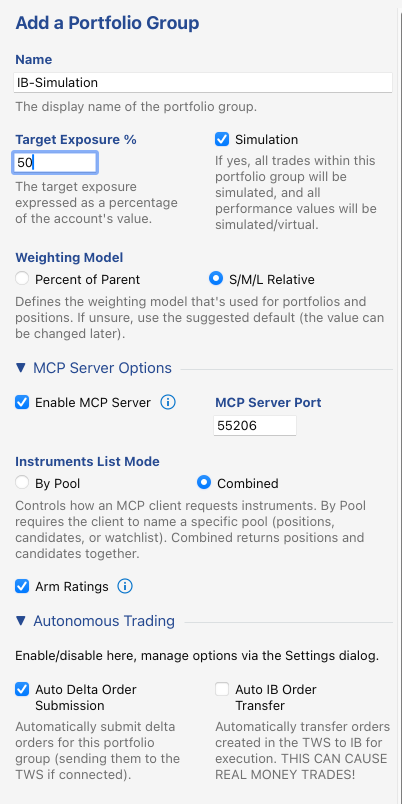

Options worth noting:

- **Simulation** — all trades in this group are simulated. 
- **Enable MCP Server** on port `55206` — this is the server the agent connects to (must match `.mcp.json`).
- **Instruments List Mode: Combined** — the agent's `list_instruments` call returns positions and candidates together.
- **Arm Ratings** — allows the agent's submitted ratings to actually drive target weights and close policies.
- **Auto Delta Order Submission** is on. When on for a simulated portfolio group, delta orders are auto-executed (simulated at the current bid/ask price, honoring slippage as configured below).

## 2. Add the portfolios

Add two portfolios to the group: a long side and a short side.

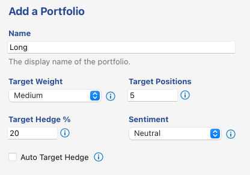

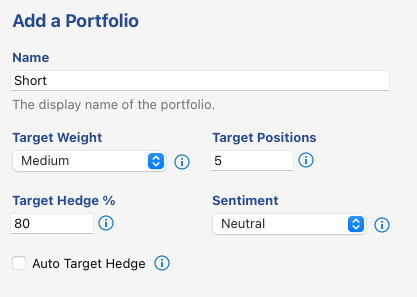

The two are identical (Target Weight *Medium*, 5 target positions, sentiment *Neutral*) except for **Target Hedge %**: 20 for `Long`, 80 for `Short` — so one trades predominantly long, the other predominantly short.

## 3. Portfolio group settings

Open the portfolio group's *Settings…* dialog (context menu on the group in the Portfolios panel), enable editing, and override the account settings as follows.

### Instrument chart range

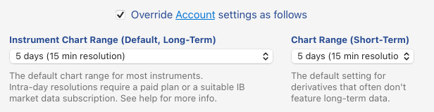

Setting the Default Chart Range (left) to **5 days (15 min resolution)** gives the agent intra-day price bars: `get_price_history` defaults to this range, and short periods return quotes that are only minutes old — the freshness the skill requires before rating an instrument. 

### Rebalancing settings

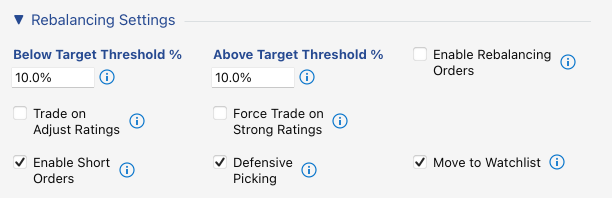

**Enable Short Orders** is required for the `Short` portfolio to work. **Move to Watchlist** will move closed instruments to the watchlist (instead of the candidates list). As a consequence, a once-closed position of an instrument will not be re-opened.

**Enable Rebalancing Orders** is off - we only buy and sell full positions; we don't rebalance/adjust open positions. **Trade on Adjust Ratings** is off. Buy/adjust is too weak a signal (or so we assume). **Force Trade on Strong Ratings** must be off. If it were on, InvMon would trade any Strong Buy or Strong Sell rating, even if all portfolio target slots are already filled. 


### Order type, size & limit calculation

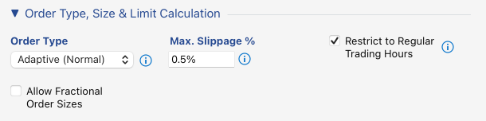

Defaults are fine here: adaptive orders, a 0.5% slippage cap, and trading restricted to regular trading hours. Slippage is relevant for simulation mode (will be used to calculate the estimated trade price - adjust the slippage to make the simulation more or less conservative in terms of achieved execution prices). The order type is not relevant for simulations.

### Close policies

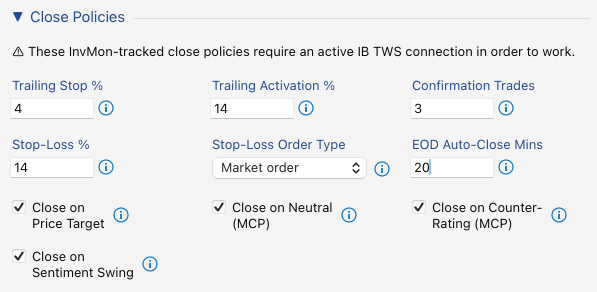

These policies close positions automatically and require an active TWS connection. The two **(MCP)** policies are what make the agent's ratings actionable: **Close on Neutral** and **Close on Counter-Rating** close a position when the agent downgrades it to Neutral or rates it against the position's direction. **EOD Auto-Close** flattens remaining positions 20 minutes before the session ends — this setup is intra-day.

### Autonomous trading gates

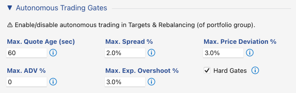

Sanity limits every automatically created order must pass (fresh quote, tight spread, limited price deviation and exposure overshoot). **Hard Gates** is an important option for simulations - with the option on, if a gate fails, no delta order is created and no execution results. The autonomous-trading on/off switches themselves live in the group's *Targets & Rebalancing* dialog (step 1).

> Failing gates are recorded on their respective instrument. Instruments with continuously failing gates are basically untradable (in a timely fashion) under current market conditions. Consecutive runs of the market scanner will recycle those first.

### MCP server options

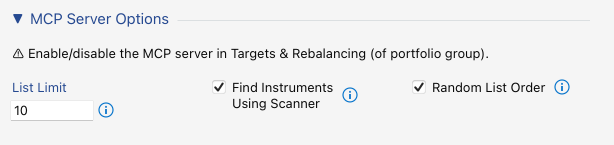

- **List Limit 10** — caps how many instruments `list_instruments` returns per call, keeping the agent's research fan-out bounded. In **Combined** mode (see above), `list_instruments` will return all of the portfolio's positions plus up to this number of candidates.
- **Find Instruments Using Scanner** — a `list_instruments` call triggers the portfolios' saved market scanners first, so the agent always rates a fresh candidate set (see next step).
- **Random List Order** — shuffles the returned list, a minor feature, potentially lowering rating bias.

## 4. Configure the market scanners

Each portfolio gets an IB market scanner that supplies its candidates: *Add from Market Scanner…* on the portfolio.

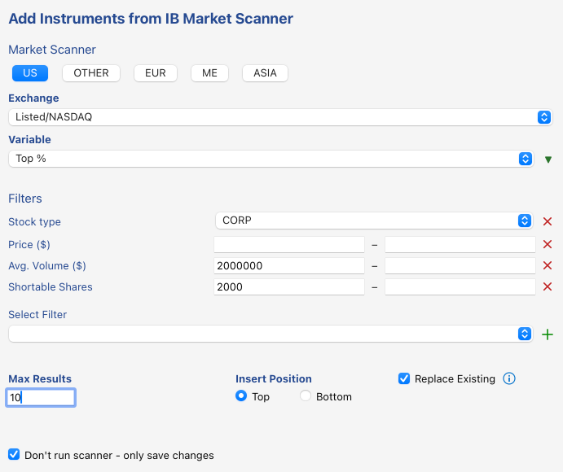

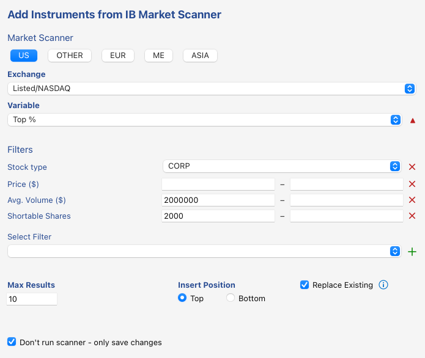

Both scan US *Listed/NASDAQ* corporate stocks by **Top %**, filtered to liquid names (average volume ≥ 2,000,000) that are shortable (shortable shares ≥ 2000), capped at 10 results with **Replace Existing** so the candidate pool rotates instead of growing. The only difference is the sort direction (the arrow next to *Variable*): descending for `Long` (top gainers), ascending for `Short` (top losers).

**Don't run scanner – only save changes** stores the configuration without running it — the scans are executed later by the MCP server (via *Find Instruments Using Scanner*) whenever the agent lists instruments.

## 5. Run the agent

With TWS connected and InvMon running:

```
cd InvMon.agent
claude
```

Then run the skill once:

```
/rating-agent
```

or in a loop during market hours:

```
/loop 1h /rating-agent
```

The agent lists the instruments, pulls price history, researches each name, submits ratings via `update_ratings`, and prints a summary. Ratings, notes, and price targets are visible in InvMon and — with the close policies above — can trigger position closes.

<!-- Editorial note: possible extensions — a screenshot of the InvMon UI after a run (ratings/notes visible on the instruments), a sample agent console summary, and a short troubleshooting section (MCP port mismatch, missing IB market data subscription). -->
