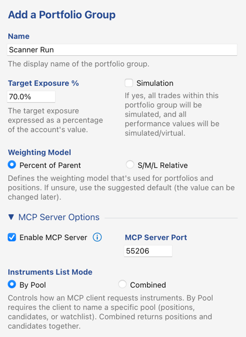
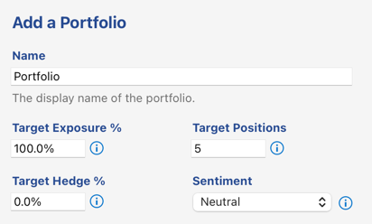
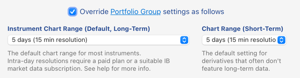
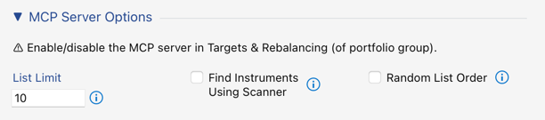
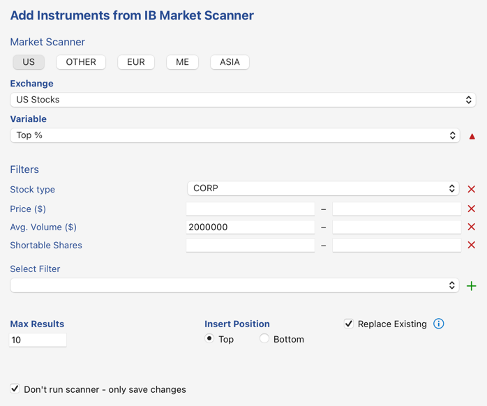
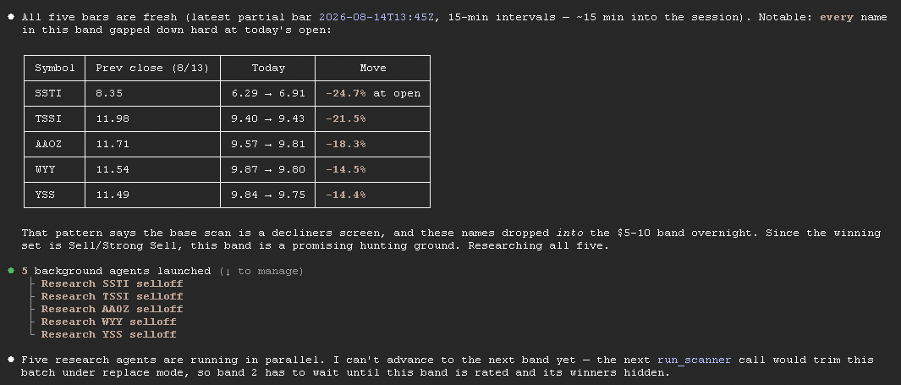

# Scan a Whole Market for Opportunities

*A worked example of the `scanner-agent` skill.*

Here's one way to put InvMon's market scanner to work: point your AI assistant at a whole market, let it scan and rate stocks for you, and hand you back a short list of the names that match the rating you were after.

In this walkthrough we go hunting for the **5 weakest names** in the US market — stocks the AI rates **Sell** or **Strong Sell** — looking at them **10 at a time**. The numbers and the rating are yours to change: *"find me 8 Strong Buys"*, *"find 3 names rated Sell between \$20 and \$50"*, and so on.

## What you need

- A **paid InvMon plan** — the market scanner comes with any paid plan.
- An **Interactive Brokers account**, with TWS running and connected. Scanning is IB-only; other data providers can't do it.
- A **portfolio in InvMon with an empty watchlist, connected to your IB account** — plus a handful of settings we'll walk through. This one portfolio is what the scan runs against.

**Already set up a scanner portfolio on an earlier run?** Skip ahead to [**Running the scan**](#5-run-the-scan) — the setup below is a one-time job. Otherwise, the next four sections build that portfolio once; after that, you just re-run the AI whenever you want a fresh scan.

> This is a **screening** pass, not trading. The AI only reads prices and records its ratings, leaving you a watchlist to review — it never places an order. The ratings are its opinion to inform *you*, not advice and not instructions to trade.

### How it works, in a nutshell

A single IB scan only ever returns the top ~50 rows of one ranked query — it can't page through an entire market. So instead of asking one impossible question, the AI sweeps the market in **price bands** (\$5–\$10, \$10–\$15, \$15–\$20, …), scanning each band as its own batch of 10, rating them, and setting aside any that match your target rating. It keeps going band by band until it has collected your 5 names — then it tidies up and leaves exactly those names on the watchlist for you. The setup below is really just about giving that sweep a clean place to work.


## 1. Create the portfolio group

Make a new portfolio group *just for scanning*. In the Portfolios panel, add a new group with these settings:



- **Enable MCP Server** on port `55206` — this is the little local connection your AI assistant talks to. Keep the port matching the one in this repo's `.mcp.json`.
- **Instruments List Mode: By Pool** — the important one. The skill needs to address the *watchlist* by name, which only *By Pool* mode allows. In *Combined* mode there's no separate watchlist to point at, and the scan can't run.
- **Simulation** — optional. Since the scan only records ratings and never trades, you don't need it; turn it on if you'd simply rather keep the whole group sandboxed.


## 2. Add the scanner portfolio

Add a single portfolio to the group. The scan works inside one portfolio, and when the group holds exactly one, the AI doesn't even need to be told which.



The weighting and target-position settings don't matter here — this is a screening pass, so nothing acts on them. What matters is that this portfolio is connected to your IB account and owns the watchlist scanner we set up in step 4.


## 3. Portfolio settings

Open the *portfolio's* **Settings…** dialog (right-click the portfolio in the Portfolios panel), enable editing, and adjust Default Chart Range (left). Setting this on the portfolio itself — rather than the whole group — keeps them local, which is handy if you're reusing an existing portfolio for the scan.

### Instrument chart range



Set it to **5 days at 15-minute resolution**. This gives the AI recent intraday price bars to judge each stock on — during trading hours those quotes are only minutes old.

Run the scan in the evening and it happily rates on the previous day's close instead; that's fine and expected. During trading hours it insists on a fresh quote and quietly skips anything that only comes back with stale end-of-day data.

### MCP server options



- **List Limit 10** — this is our batch size, the "10 at a time" from the top. It caps the watchlist at 10 names, and it's the size the scanner trims back to between bands. IB tops out around 50 rows per scan anyway (that's the whole reason for sweeping band by band), so 10 sits comfortably under the ceiling — and a small batch keeps your TWS market-data lines free, since every visible watchlist name uses one.
- **Find Instruments Using Scanner** — must be **off**. Left on, InvMon would re-run the scanner behind the AI's back and wipe out the batch it just built. The skill checks for this and refuses to run rather than quietly corrupt the sweep.
- **Random List Order** — optional; shuffles each batch, which can take a little bias out of the ratings.


## 4. Configure the watchlist market scanner

This is the actual scan the sweep builds on. Open the portfolio's **Watchlist** panel and choose **Add from Market Scanner…** — starting it from the Watchlist panel is what makes the results land in the watchlist.



Set it up as a **US decliners** screen:

- **Region US**, **Exchange US Stocks**.
- **Variable Top %**, direction set to **losers** (the red triangle beside it) — the day's biggest decliners, exactly the pool most likely to earn a *Sell*.
- **Stock type CORP**, plus a liquidity floor so you only get names you can actually trade — e.g. **Avg. Volume 2,000,000**. Leave **Price** empty (see the note below).
- **Max Results 10** — matched to the *List Limit* from step 3.
- **Replace Existing — on.** This is what makes the sweep self-cleaning: each new band's scan clears out the previous band's leftovers automatically, and the names already set aside survive.
- **Don't run scanner – only save changes — on.** You're just *saving* the scan for the AI to use later, not filling the watchlist now.

> **Pick the scan to match what you're hunting.** Ranking by the day's *losers* stacks the deck toward *Sell* ratings; if you were after Buys, you'd rank by *gainers* instead. Either way the AI still judges every stock on its own merits — the scan only decides which stocks it looks at.

> **Don't set a Price filter here.** Price is the one dial the AI turns itself, band by band. Anything you pin here becomes a hidden floor or ceiling on *every* band and quietly starves the sweep.


## 5. Run the scan

With TWS connected and InvMon running, open this repo in your AI assistant. This tutorial uses Claude Code, which this repository is already set up for:

```
cd InvMon.agent
claude
```

Then start the skill:

```
/scanner-agent
```

Left to itself the skill goes looking for **10** names rated `Strong Buy` or `Buy`, sweeping **\$5 to \$100 in \$5 bands**. Since we want the *downside* instead, just say so in plain language when you launch it:

```
/scanner-agent find 5 names rated Sell or Strong Sell between $5 and $100, bands of $5
```

Everything is set this way — how many names, which ratings count, and the price range all come straight from what you type. We're keeping the default \$5–\$100 range in \$5 bands; with only 5 names to find, the sweep will almost always stop long before it works through all of them.

It's a **one-shot** run: the AI sweeps band by band until it has your 5 names (or runs out of bands), cleans up, and stops. There's no need to loop it — and running a second sweep in the same InvMon session works from a shrinking universe (see the note at the very end), so restart InvMon before a fresh run.


## 6. What you see while it runs

The watchlist churns as the scan runs: each band replaces the last one's leftovers, so it only ever holds about one batch, and the names already banked as matches are hidden from view. A watchlist that looks nearly empty mid-run is exactly right, not a sign anything's being lost.

Mostly, though, you watch the AI think in the console — for each band it pulls the batch, sizes up the price action, and fans out a research agent per name before rating them:



When it finishes, it clears the last band's leftovers and un-hides everything it kept, so the watchlist ends up holding exactly your shortlist — each name carrying the AI's rating, a note, and a price target where it set one. It also prints a short summary: the names it picked with a one-line reason each, how many bands it swept, and — if it ran out of bands before reaching 5 — how far it got.


## 7. Troubleshooting

Most hiccups are a setup step that isn't quite right, and the scan usually tells you which one:

| What you see | What it means | What to do |
|---|---|---|
| `run_scanner is not available.` | Your plan doesn't include the market scanner. | Upgrade to a paid plan. |
| `run_scanner requires 'Find Instruments Using Scanner' to be OFF…` | That option is on and would clobber each batch. | Turn it off in *MCP Server Options* (step 3). |
| `Account is not connected; cannot run the scanner.` | TWS isn't running or isn't connected. | Start TWS and confirm the account connects. |
| `The account's provider does not support market scanning.` | The portfolio isn't pointed at an IB account. | Point the group at your IB account. |
| `A scanner run is already in progress for this portfolio.` | A scan (manual or from a previous call) is still running. | Wait for it to finish, then re-run. |
| `Portfolio not found; specify portfolioId or portfolioName…` | The group holds more than one portfolio. | Name the portfolio when you start the skill, or keep the group to one. |
| `Scanner timed out after 60 seconds.` | IB didn't answer in time. | Usually a blip — check the TWS connection and re-run. |
| `This tool call is currently limited to the watchlist pool.` | On your plan the set-aside tools only touch watchlist names. | Expected — the scan only ever touches the watchlist. If you see it, something aimed the tools elsewhere. |
| The AI reports a missing `watchlist` pool | The group is in *Combined* list mode. | Switch **Instruments List Mode** to *By Pool* (step 1). |
| Bands come back empty that shouldn't | Either a price filter got baked into the saved scan, or those names were cleared earlier this session. | Remove the base price filter (step 4). For the second cause, see below. |

**Why a second run in the same session finds less.** Once the scanner clears a name out during a run, InvMon keeps it out for the rest of the session so a later band won't waste time re-rating something already dropped. Within one run that's exactly what you want. Across two runs it means the second one is working from a thinner universe — so **restart InvMon before a fresh scan**, or bring individual names back via *Restore Hidden Instrument…* (in the Delete menu).

<!-- Editorial note: possible extensions — a worked example run (bands swept vs. names rated vs. winners
     found, with timings), and guidance on choosing a band schedule for non-US or non-equity universes. -->
